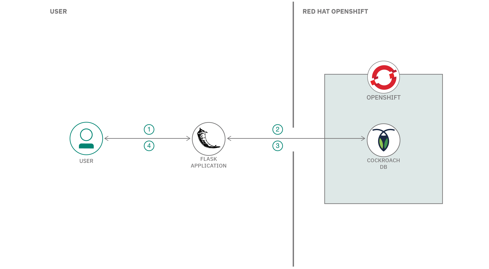
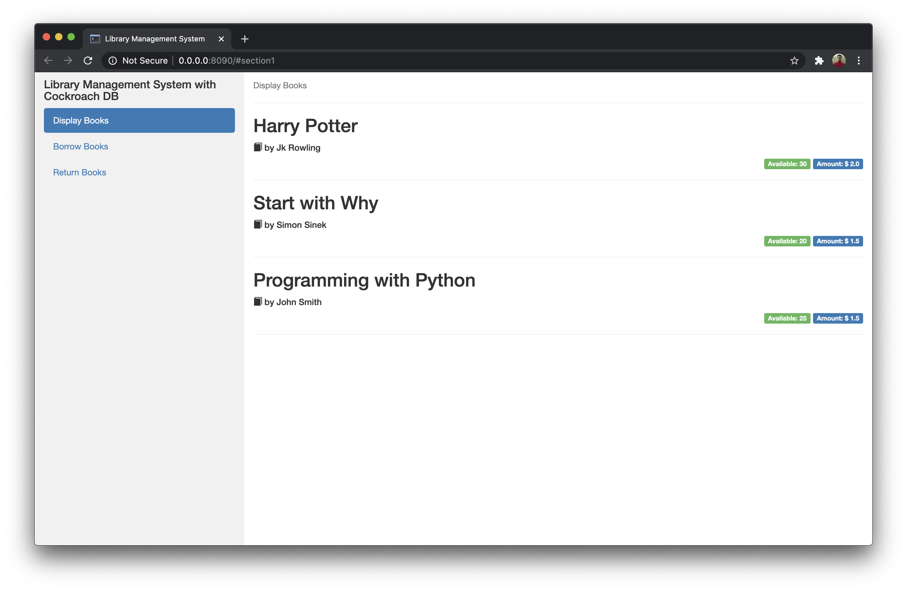
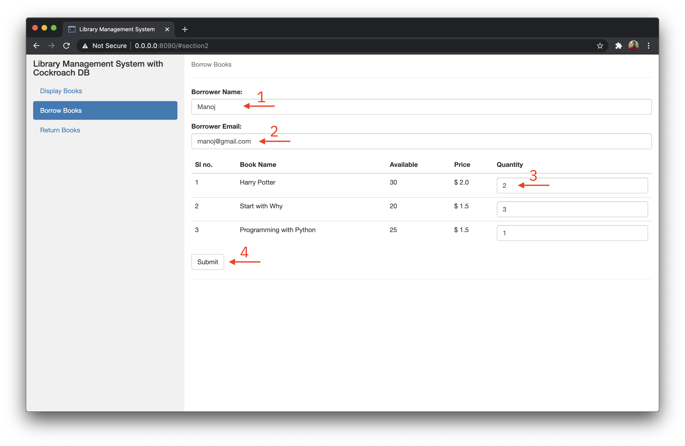
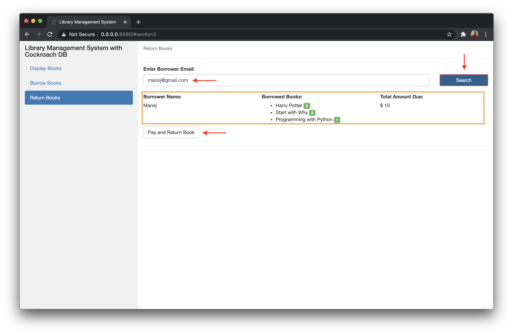
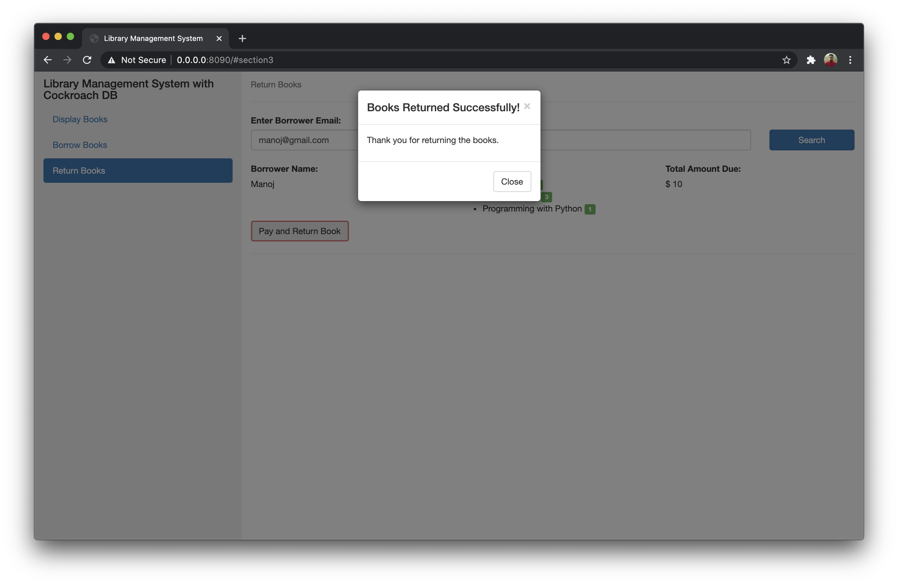

# Library Management System using CockroachDB hosted on Red Hat Marketplace

A Library Management System is a software that uses to maintain the record of the library. It contains work like the number of available books in the library, the number of books are issued or returning or renewing a book or late fine charge record, etc.

In this code pattern, we will build a Library Management System using CockroachDB hosted on RHM. CockroachDB is an ultra resilient, distributed SQL that can easily scale-out serializable transactions for your apps and services. It is cloud-native, architected to simplify scale and also guarantee consistent transactions across multiple regions and multiple clouds.

When you have completed this code pattern, you will understand how to:

* Install CockroachDB Operator from Red Hat Marketplace on a OpenShift Cluster
* Create a CockroachDB cluster instance
* Create a user and database in CockroachDB
* Store and query unstructured JSON data from a third-party API in CockroachDB
* Manage CockroachDB cluster from the Cluster Overview page



## Flow

1. User performs an operation like `borrowing a book` or `returning a book`.
2. Application updates appropriate CockroachDB table accordingly.
3. Application fetches the updated data from the table.
4. Application displays the updated data that was feteched from the table. 

## Steps

1. [Clone the repo](#1-clone-the-repo)
2. [Setup CockroachDB Operator on OpenShift](#2-setup-cockroachdb-operator-on-openshift)
3. [Port Forward CockroachDB](#3-port-forward-cockroachdb)
4. [Run the Application](#4-run-the-application)
5. [Explore the Library Management System](#5-explore-the-library-management-system)


### 1. Clone the repo

Clone the `library-management-system-using-cockroachdb-hosted-on-rhm` repo locally. In a terminal, run:

```bash
git clone https://github.com/IBM/library-management-system-using-cockroachdb-hosted-on-rhm
```

### 2. Setup CockroachDB Operator on OpenShift

- Follow the first 3 steps from the Tutorial to install CockroachDB Operator on OpenShift from Red Hat Marketplace.
    - [Tutorial to Setup CockroachDB Operator on Red Hat OpenShift](https://github.com/IBM/store-and-query-unstructured-json-cockroachdb-operator-rhm)

- Once the CockroachDB Operator is setup, create a database called `library` in CockroachDB.

- In terminal Run the following command to spin up a CockroachDB client:

```bash
$ kubectl run -it --rm cockroach-client \
--image=cockroachdb/cockroach \
--restart=Never \
--command -- \
./cockroach sql --insecure --host=example-cockroachdb-public.cockroachdb-test
```

- This should run the CockroachDB client and take you to a `SQL Command Prompt` as shown. If you don't see a command prompt, try pressing enter.

```bash
root@example-cockroachdb-public.cockroachdb-test:26257/defaultdb>
```

- Create a database called `library` by running the following command:

<pre><code>
root@example-cockroachdb-public.cockroachdb-test:26257/defaultdb> <b>CREATE DATABASE library;</b>
</code></pre>

- You can come out of the SQL Prompt by the `\q` command:

<pre><code>
root@example-cockroachdb-public.cockroachdb-test:26257/defaultdb> <b>\q</b>
</code></pre>


### 3. Port Forward CockroachDB

- Once the CockroachDB Operator is setup successfully on your OpenShift Cluster, we need to port forward the CockroachDB database instance from OpenShift to establish connection in our application locally.  

- In Terminal run the following command to port forward `26257` port from the CockroachDB database instance.

>NOTE: You must be logged in with your `OC login` credentials before running the following commands.

```bash
$ kubectl port-forward example-cockroachdb-0 26257
```

```bash
Forwarding from 127.0.0.1:26257 -> 26257
Forwarding from [::1]:26257 -> 26257
```

### 4. Run the Application

- Goto the cloned repo from [step 1](#1-clone-the-repo), in Terminal run the following commands to install the required python libraries and run the app

    - Install Required python libraries, by running the following command:

    ```bash
    $ pip install -r requirements.txt
    ```

    - Run the application as follows:

    ```bash
    $ python app.py
    ```

    - The application will be listening on `<http://localhost:8090>`

### 5. Explore the Library Management System

- Visit <http://localhost:8090> on your browser.

- There are three **Tabs**, `Display Books`, `Borrow Books` and `Return Books`.

- In `Display Books`, you can see three books listed, the book details include:
    - Book Name
    - Book Author
    - Book Availibility
    - Book Amount

>NOTE: These details are initialized by the python script.



- Click on the `Borrow Books` tab, you can borrow the available books from the store. Borrower details include:
    - Borrower Name
    - Borrower Email
    - Available books that can be borrowed

- Enter your `name`, `email` and `book quantities` that you wish to borrow and finally click on `submit` as shown.

- On Successfully borrowing, you can see the availibility of the books decreasing.



- Click on the `Return Books` tab, you can return the borrowed books from here.

- Enter your `email` from which you borrowed the books, and click on search.

- Your name, the books that you have borrowed and the total amount due will be displayed. Click on pay and return to return the books as shown.



- On Successfully returning the books, you will get an aleart as shown.



- You can see the availibility of the books increased again in the `Display Books` section.

- You can verify the table in the ClockroachDB instance through the CockroachDB client from terminal.

- In terminal Run the following command to spin up a CockroachDB client:

```bash
$ kubectl run -it --rm cockroach-client \
--image=cockroachdb/cockroach \
--restart=Never \
--command -- \
./cockroach sql --insecure --host=example-cockroachdb-public.cockroachdb-test
```

- This should run the CockroachDB client and take you to a `SQL Command Prompt` as shown. If you don't see a command prompt, try pressing enter.

```bash
root@example-cockroachdb-public.cockroachdb-test:26257/defaultdb>
```

- From the CockroachDB client, run the following commands to view `user`, `database` and `table` which was created by the Library Management Application:

    - View `users` by running the `SHOW users;` command as follows:
    <pre><code>root@example-cockroachdb-public.cockroachdb-test:26257/defaultdb> <b>SHOW users;</b>
    user_name
    `-------------`
    cpuser
    maxroach
    root
    (3 rows)

    Time: 3.037641ms
    </code></pre>

    - View `databases` by running the `SHOW databases;` command as follows:
    <pre><code>root@example-cockroachdb-public.cockroachdb-test:26257/defaultdb> <b>SHOW databases;</b>
    database_name
    `-----------------`
    bank
    defaultdb
    library
    postgres
    system
    (5 rows)

    Time: 2.890031ms</code></pre>

    - To view the tables present in `library` database, run the `USE library;` command to switch to `library` database, and run `\d` command to view the `tables` as follows:
    <pre><code>root@example-cockroachdb-public.cockroachdb-test:26257/defaultdb> <b>USE library;</b>
    SET

    Time: 11.83841ms

    root@example-cockroachdb-public.cockroachdb-test:26257/library> <b>\d</b>
    table_name
    `----------------------`
    books
    borrowers
    (2 rows)

    Time: 3.684617ms</code></pre>

    - Finally to view the tables `books` and `borrowers` run the `SELECT` command as follows:
    <pre><code>root@example-cockroachdb-public.cockroachdb-test:26257/defaultdb> <b>SELECT * FROM books;</b>
    </code></pre>
    
    ```bash
    id |        book_name        | book_author | book_price | book_availability
    -----+-------------------------+-------------+------------+--------------------
    1 | Harry Potter            | Jk Rowling  |          2 |                30
    2 | Start with Why          | Simon Sinek |        1.5 |                20
    3 | Programming with Python | John Smith  |        1.5 |                25
    ```
   
    <pre><code>root@example-cockroachdb-public.cockroachdb-test:26257/defaultdb> <b>SELECT * FROM borrowers;</b>
    </code></pre>
    
    ```bash
              id         | borrower_name | borrower_email  | book_id | total_price | book_quantity
    ---------------------+---------------+-----------------+---------+-------------+----------------
    572547941512544257 | Manoj         | manoj@gmail.com | 1,2,3   |        12.5 | 4,1,2
    ```

# Summary


# Troubleshooting

<!-- keep this -->
## License

This code pattern is licensed under the Apache License, Version 2. Separate third-party code objects invoked within this code pattern are licensed by their respective providers pursuant to their own separate licenses. Contributions are subject to the [Developer Certificate of Origin, Version 1.1](https://developercertificate.org/) and the [Apache License, Version 2](https://www.apache.org/licenses/LICENSE-2.0.txt).

[Apache License FAQ](https://www.apache.org/foundation/license-faq.html#WhatDoesItMEAN)
